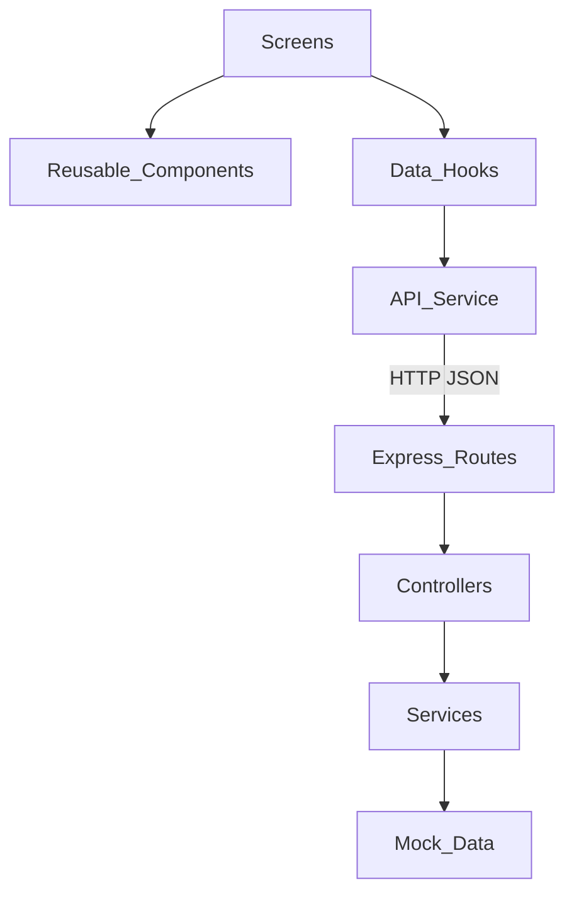
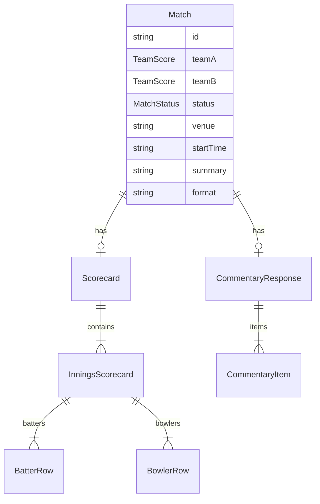
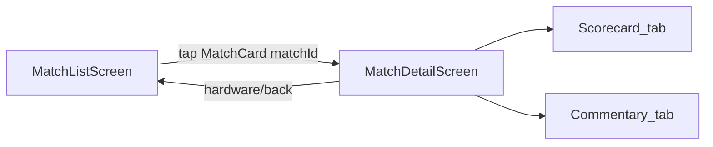

# Cricket Scores MVP — Implementation Plan (Task 1)

## Requirements summary

Build a focused full-stack cricket scores demo that proves:

- React Native + TypeScript mobile skills
- Node.js + Express + TypeScript REST API skills
- Clean layered architecture, reusable UI, typed models
- Match list/filter, details, scorecard, commentary
- Loading / error / empty / retry / refresh UX

**Explicitly out of scope:** auth, admin, live cricket feeds, production DB, WebSockets, push notifications.

**Stack decisions (locked for this plan):**

- Monorepo: `backend/` + `mobile/` + root `README.md`
- Mobile: Expo + TypeScript + React Navigation (native stack)
- Backend: Express + TypeScript + in-memory mock data
- HTTP: `fetch` + thin typed API layer (no Redux / React Query)

---

## 1. Project architecture



**Backend layering**

| Layer | Responsibility |
|-------|----------------|
| Routes | Map URLs to controller handlers |
| Controllers | Parse params/query, call services, send JSON |
| Services | Business rules: filter, lookup, validate status |
| Mock data | In-memory matches, scorecards, commentary |
| Middleware | CORS, JSON body, 404, centralized errors |

**Mobile layering**

| Layer | Responsibility |
|-------|----------------|
| Screens | Compose UI + wire hooks/navigation |
| Components | Presentational, reusable |
| Hooks | Own loading/error/data/refresh state |
| API | Typed `fetch` client + match endpoints |
| Types | Shared conceptual models with backend |

---

## 2. Folder structure

```text
OneStopDemo/
├── README.md
├── IMPLEMENTATION_PLAN.md          # optional export of this Task 1 plan
├── backend/
│   ├── package.json
│   ├── tsconfig.json
│   └── src/
│       ├── index.ts                # listen 0.0.0.0:3000
│       ├── app.ts                  # express app wiring
│       ├── routes/matches.routes.ts
│       ├── controllers/matches.controller.ts
│       ├── services/matches.service.ts
│       ├── data/matches.mock.ts
│       ├── types/match.types.ts
│       └── middleware/errorHandler.ts
└── mobile/
    ├── App.tsx
    ├── app.json
    ├── package.json
    └── src/
        ├── api/client.ts
        ├── api/matchesApi.ts
        ├── types/match.ts
        ├── constants/config.ts
        ├── theme/colors.ts
        ├── navigation/RootNavigator.tsx
        ├── screens/MatchListScreen.tsx
        ├── screens/MatchDetailScreen.tsx
        ├── hooks/useMatches.ts
        ├── hooks/useMatchDetail.ts
        └── components/
            ├── MatchCard.tsx
            ├── StatusFilter.tsx
            ├── ScorecardView.tsx
            ├── CommentaryList.tsx
            ├── LoadingState.tsx
            ├── ErrorState.tsx
            ├── EmptyState.tsx
            └── RetryButton.tsx
```

---

## 3. Data model design



**Core types**

- `MatchStatus`: `LIVE` | `UPCOMING` | `COMPLETED`
- `TeamScore`: `name`, `shortName`, `runs|wickets|overs` (nullable for upcoming)
- `Match`: identity + teams + status + venue + `startTime` (ISO) + `summary` + `format`
- `Scorecard`: `matchId` + `innings[]` (batting/bowling rows, totals, extras)
- `CommentaryItem`: `id`, `over`, `ball`, `text`, `timestamp`, optional `isWicket` / `isBoundary`

**Mock dataset rules**

- 6–8 matches covering all three statuses
- LIVE/COMPLETED: scorecard + 15–30 commentary lines
- UPCOMING: no scorecard/commentary (API returns 404 for those resources)

**API envelope**

- Success: `{ data: T }` or `{ data: T[] }`
- Error: `{ message: string }` + HTTP status

---

## 4. API design

| Method | Path | Behavior | Status codes |
|--------|------|----------|--------------|
| GET | `/health` | Liveness | 200 |
| GET | `/api/matches` | All matches | 200 |
| GET | `/api/matches?status=` | Filter by status | 200; **400** invalid status |
| GET | `/api/matches/:matchId` | Match detail | 200; **404** |
| GET | `/api/matches/:matchId/scorecard` | Scorecard | 200; **404** |
| GET | `/api/matches/:matchId/commentary` | Commentary list | 200; **404** |

Valid `status` values: `LIVE`, `UPCOMING`, `COMPLETED` (case-insensitive normalize to uppercase).

Server binds to `0.0.0.0:3000` for emulator/LAN access. Mobile uses `EXPO_PUBLIC_API_URL` or defaults (`localhost` / Android `10.0.2.2`).

---

## 5. Navigation flow



- Stack: `MatchList` → `MatchDetail({ matchId })`
- Detail uses in-screen tabs (Scorecard | Commentary), not nested navigators
- List filters are local state (All / Live / Upcoming / Completed), not routes

---

## 6. Component design

| Component | Role |
|-----------|------|
| `StatusFilter` | Horizontal chips; emits filter change |
| `MatchCard` | Teams, scores, status badge, venue, date; navigates on press |
| `ScorecardView` | Innings batting/bowling tables; empty/unavailable messaging |
| `CommentaryList` | `FlatList` of ball-by-ball rows; empty/unavailable |
| `LoadingState` | Centered spinner + message |
| `ErrorState` | Message + `RetryButton` |
| `EmptyState` | Title + supporting copy (e.g. no matches for filter) |
| `RetryButton` | Primary action to re-fetch |

**Screens**

- `MatchListScreen`: filter + `FlatList` + RefreshControl + loading/error/empty/retry
- `MatchDetailScreen`: header (teams/scores/status/venue/date) + tabs + refresh; scorecard 404 treated as “unavailable”, not full-screen failure if match loaded

---

## 7. Error handling strategy

**Backend**

- `AppError(message, statusCode)` thrown from services
- Controllers `try/catch` → `next(err)`
- Central `errorHandler` returns `{ message }`
- Unknown routes → 404 middleware
- Invalid query → 400; missing match/resource → 404

**Mobile**

| State | When | UI |
|-------|------|-----|
| Loading | First fetch / retry | `LoadingState` |
| Error | Network/timeout/5xx/match 404 | `ErrorState` + Retry |
| Empty | 200 with `[]` or no commentary rows | `EmptyState` |
| Refresh | Pull-to-refresh | Keep list visible; `refreshing` flag |
| Partial | Scorecard/commentary 404 on detail | Section unavailable message; match header still shown |

Client: timeout (~10s), abort, map failures to user-readable messages. Hooks (`useMatches`, `useMatchDetail`) own state machines; screens stay presentational.

---

## 8. Backend implementation phases

1. **Scaffold** — `package.json`, `tsconfig`, Express app, CORS, health route, error middleware
2. **Types + mock data** — models; 6–8 matches; scorecards/commentary for playable matches
3. **Service layer** — get/filter/byId/scorecard/commentary with validation
4. **Controllers + routes** — wire all five match endpoints under `/api/matches`
5. **Smoke verify** — `curl` happy paths + 400/404 cases; `tsc` build clean

---

## 9. Mobile implementation phases

1. **Scaffold** — Expo TS app; React Navigation; Safe Area; theme/config
2. **Types + API** — mirror backend models; `apiGet`; `matchesApi`
3. **State components** — Loading / Error / Empty / Retry
4. **Match list** — hooks, filter, `MatchCard`, `FlatList`, refresh
5. **Match detail** — header, tabs, scorecard, commentary `FlatList`, refresh/partial errors
6. **Integration** — point at local API; verify emulator/device URL docs

---

## 10. Testing strategy (MVP-appropriate)

No heavy test framework required for the demo; verify with a lightweight checklist:

**Backend (manual / curl)**

- All matches count and shape
- Each status filter returns only matching rows
- Invalid status → 400
- Known `matchId` → 200; unknown → 404
- Upcoming match scorecard/commentary → 404
- LIVE/COMPLETED scorecard/commentary → 200 with expected lengths

**Mobile (manual on simulator/device)**

- List loads; filters change results
- Pull-to-refresh
- Stop API → error + Retry recovers
- Filter with no results → empty
- Open live match → scorecard + commentary
- Open upcoming → unavailable messaging for missing sections
- Back navigation works

**Static checks**

- `backend`: `npm run build` (`tsc`)
- `mobile`: `npx tsc --noEmit`

---

## 11. README documentation plan

Root `README.md` must include:

1. Project purpose and feature list
2. Architecture diagram (text or mermaid)
3. Folder structure overview
4. Prerequisites (Node 20+, Expo Go / emulator)
5. Run backend + run mobile
6. API table + `curl` examples
7. `EXPO_PUBLIC_API_URL` / Android `10.0.2.2` notes
8. Assumptions and limitations (mock data, no realtime/auth/DB)
9. Screen-recording checklist (5–10 min): app walkthrough, tech decisions, structure, key code, limitations

---

## 12. Deliverables checklist (maps to assignment)

- React Native (Expo) mobile app + Express TS backend
- Typed models + mock data + working REST APIs
- List + filter, details, scorecard, commentary
- Loading / error / empty / retry / refresh
- Clean structure + complete README
- Screen recording produced by the author (not generated in-repo)

---

## Execution order after plan approval

1. Export/confirm this plan (Task 1 complete)
2. Implement backend phases 1–5
3. Implement mobile phases 1–6
4. Run testing checklist
5. Finalize README
6. Author records the walkthrough video

**Note:** A working implementation may already exist under [`backend/`](backend/) and [`mobile/`](mobile/). After approval, next work should either validate that codebase against this plan or fill any gaps — not redesign the stack.